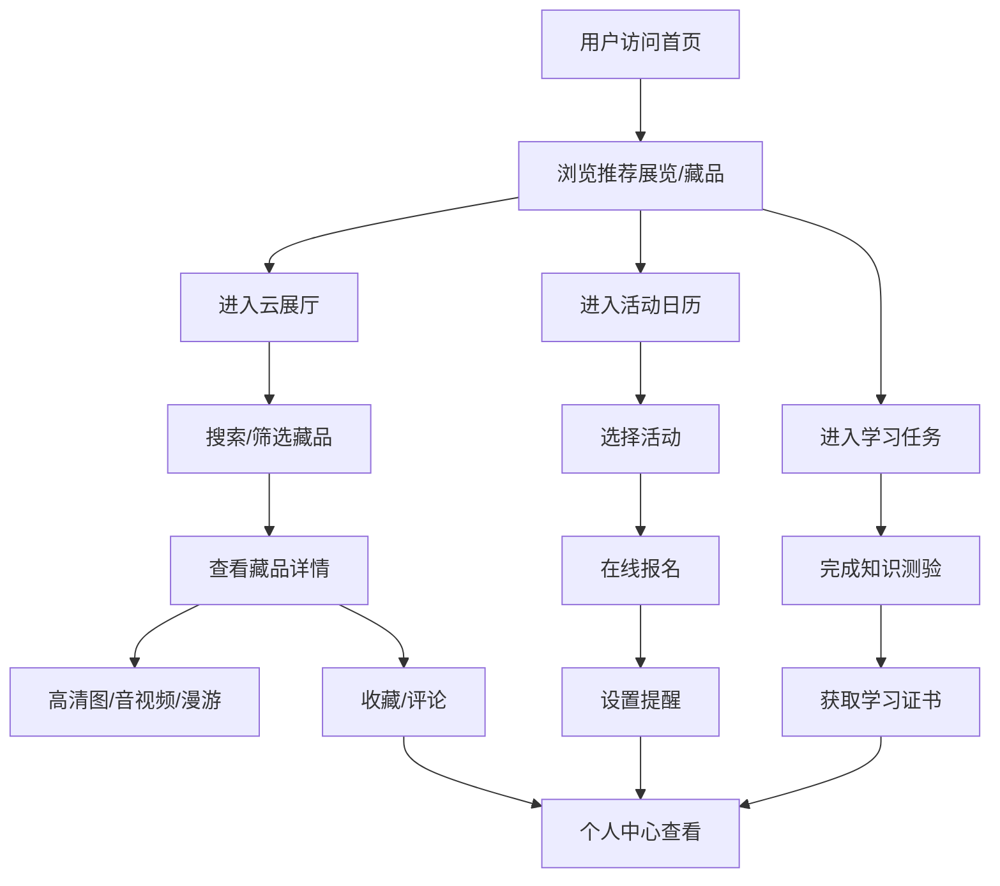

## 1. 产品概述
数字文化馆 Web 应用，让市民、学生在线逛馆学习文化知识，为馆内运营人员提供内容管理和活动维护工具。
- 面向普通市民、学生群体、馆内运营人员三类用户
- 打造沉浸式线上文化体验，实现文物数字化展示与文化知识传播

## 2. 核心功能

### 2.1 用户角色
| 角色 | 注册方式 | 核心权限 |
|------|----------|----------|
| 普通游客 | 无需注册 | 浏览展览、查看藏品、浏览活动信息 |
| 注册用户 | 手机号/邮箱注册 | 藏品收藏、评论提问、活动报名、学习测验、获取证书 |
| 运营人员 | 管理员后台登录 | 内容发布、藏品管理、活动管理、留言审核、数据导出 |

### 2.2 功能模块
1. **首页**：轮播推荐、精选展览、快速导航、热门藏品、活动预告
2. **云展厅**：关键词搜索、类别筛选、年代轴浏览、藏品网格展示
3. **藏品详情**：高清图片查看、音视频讲解、虚拟漫游、收藏、评论提问
4. **活动日历**：月历视图、活动列表、在线报名、预约提醒
5. **学习任务**：知识测验、学习进度、证书获取
6. **个人中心**：我的收藏、报名记录、学习证书、浏览统计
7. **管理后台**：内容发布、藏品管理、活动管理、留言审核、数据导出

### 2.3 页面详情
| 页面名称 | 模块名称 | 功能描述 |
|----------|----------|----------|
| 首页 | Hero 轮播 | 自动轮播精选展览和重要活动，支持手动切换 |
| 首页 | 快速导航 | 云展厅、活动日历、学习任务、个人中心入口卡片 |
| 首页 | 精选展览 | 横向滚动展示当前热门展览，点击进入详情 |
| 首页 | 热门藏品 | 网格布局展示推荐藏品，带类别标签 |
| 首页 | 活动预告 | 时间线展示近期活动，支持一键报名 |
| 云展厅 | 搜索栏 | 关键词实时搜索藏品，支持联想建议 |
| 云展厅 | 分类筛选 | 按类别（书画/陶瓷/玉器/青铜/其他）筛选藏品 |
| 云展厅 | 年代轴 | 横向时间轴，按朝代/年代筛选藏品 |
| 云展厅 | 藏品列表 | 响应式网格布局，支持卡片悬停动效 |
| 藏品详情 | 高清图片 | 多图切换，支持放大查看，图片轮播 |
| 藏品详情 | 音视频讲解 | 内嵌音频播放器和视频讲解区域 |
| 藏品详情 | 虚拟漫游 | 360° 全景浏览模拟，场景切换按钮 |
| 藏品详情 | 收藏按钮 | 一键收藏/取消收藏，状态即时反馈 |
| 藏品详情 | 评论提问 | 评论列表、发表评论、提问功能 |
| 活动日历 | 月历视图 | 日期格子展示活动标记，可切换月份 |
| 活动日历 | 活动列表 | 选中日期的活动卡片列表，含状态标签 |
| 活动日历 | 活动报名 | 报名表单，预约成功后显示提醒设置 |
| 学习任务 | 知识测验 | 选择题答题，进度条，即时反馈对错 |
| 学习任务 | 学习进度 | 任务列表、完成度百分比、解锁状态 |
| 学习任务 | 学习证书 | 完成任务后可生成并下载证书图片 |
| 个人中心 | 用户信息 | 头像、昵称、积分、学习等级展示 |
| 个人中心 | 我的收藏 | 收藏的藏品列表，支持取消收藏和跳转详情 |
| 个人中心 | 报名记录 | 已报名活动列表，含状态和提醒开关 |
| 个人中心 | 学习证书 | 已获得证书展示，支持预览和下载 |
| 个人中心 | 浏览统计 | 浏览时长、藏品数、活动数图表展示 |
| 管理后台 | 仪表盘 | 数据概览图表（访问量、用户数、活动数） |
| 管理后台 | 内容发布 | 藏品/展览新增编辑表单，图片上传 |
| 管理后台 | 留言审核 | 用户评论列表，通过/驳回操作 |
| 管理后台 | 数据导出 | 选择数据类型，导出 CSV/Excel |

## 3. 核心流程

用户浏览与收藏流程：
用户进入首页 → 浏览推荐内容 → 点击进入云展厅 → 通过搜索/筛选/年代轴查找藏品 → 点击藏品查看详情 → 查看高清图/音视频/虚拟漫游 → 收藏藏品/发表评论

活动报名流程：
用户进入活动日历 → 查看月历或活动列表 → 选择感兴趣活动 → 点击报名 → 填写报名信息 → 预约成功 → 设置提醒 → 活动前收到通知

学习任务流程：
用户进入学习任务 → 选择学习主题 → 阅读资料 → 完成知识测验 → 查看答题结果 → 解锁下一关 → 完成全部任务 → 获取学习证书

## 4. 用户界面设计

### 4.1 设计风格
- **主色调**：古典墨色 #1a1a2e 搭配朱红 #c9a227 金色点缀，营造典雅文化氛围
- **辅助色**：米白 #f5f0e6 背景、石青 #2d5a5b 强调色
- **按钮风格**：圆角 8px，主按钮金色渐变，悬停有微光动效
- **字体**：标题使用 "Noto Serif SC" 衬线体，正文使用 "Noto Sans SC"
- **布局风格**：卡片式布局，大量留白，细腻阴影，国风装饰线条
- **图标风格**：线性 lucide 图标，统一 20px，金色描边

### 4.2 页面设计概览
| 页面名称 | 模块名称 | UI 元素 |
|----------|----------|----------|
| 首页 | Hero 轮播 | 全屏大图叠加渐变遮罩，标题衬线大字，指示器金色圆点，淡入淡出动画 |
| 首页 | 快速导航 | 四张卡片，图标+文字，悬停上浮+阴影加深 |
| 云展厅 | 年代轴 | 横向可滚动时间轴，节点圆圈，选中节点金色高亮 |
| 云展厅 | 藏品卡片 | 图片 4:3，底部半透明遮罩显示标题和朝代，悬停轻微放大 |
| 藏品详情 | 高清图区 | 左侧主图，右侧缩略图列表，放大镜光标 |
| 藏品详情 | 音视频区 | 黑金配色播放器，进度条金色高亮 |
| 活动日历 | 月历 | 大格子，有活动的日期右下角金色圆点，选中日期金色边框 |
| 学习任务 | 测验卡片 | 选项悬停背景变色，答对绿色边框，答错红色边框 |
| 个人中心 | 数据统计 | 迷你折线图/柱状图，金色数据点 |
| 管理后台 | 侧边栏 | 深色侧边栏，金色激活项，图标+文字 |

### 4.3 响应式
- 采用桌面优先设计，断点：1280px / 1024px / 768px / 480px
- 桌面端多列布局，平板端两列，移动端单列堆叠
- 导航栏在移动端转为汉堡菜单
- 年代轴在移动端垂直排列
- 触控区域最小 44px，优化移动端点击体验

