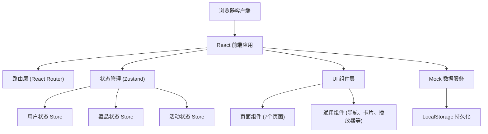
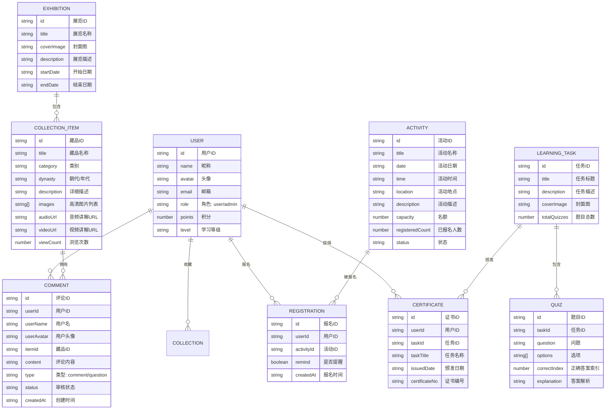

## 1. 架构设计



## 2. 技术描述
- **前端框架**：React 18 + TypeScript + Vite
- **UI 样式**：Tailwind CSS 3
- **状态管理**：Zustand
- **路由方案**：React Router DOM 6
- **图标库**：Lucide React
- **数据方案**：Mock 数据 + LocalStorage 持久化，无需后端服务
- **初始化工具**：vite-init，使用 react-ts 模板

## 3. 路由定义
| 路由路径 | 页面名称 | 用途说明 |
|----------|----------|----------|
| / | 首页 | 展示轮播、精选展览、快速导航、热门藏品、活动预告 |
| /exhibition | 云展厅 | 藏品搜索、分类筛选、年代轴浏览、藏品列表展示 |
| /exhibition/:id | 藏品详情 | 高清图、音视频讲解、虚拟漫游、收藏、评论提问 |
| /calendar | 活动日历 | 月历视图、活动列表、活动报名、预约提醒设置 |
| /learning | 学习任务 | 知识测验、学习进度展示、证书获取 |
| /profile | 个人中心 | 个人信息、我的收藏、报名记录、证书展示、浏览统计 |
| /admin | 管理后台 | 仪表盘、内容发布、留言审核、数据导出 |

## 4. 数据模型

### 4.1 数据模型定义



### 4.2 Store 设计

**UserStore**
- user: 当前登录用户信息
- isLoggedIn: 登录状态
- favorites: 收藏的藏品 ID 列表
- registrations: 报名记录
- certificates: 获得的证书
- browseHistory: 浏览历史

**CollectionStore**
- items: 藏品列表
- exhibitions: 展览列表
- searchKeyword: 搜索关键词
- selectedCategory: 选中的分类
- selectedDynasty: 选中的年代
- currentItem: 当前查看的藏品
- comments: 藏品评论列表

**ActivityStore**
- activities: 活动列表
- selectedDate: 当前选中的日期
- currentActivity: 当前查看的活动

**LearningStore**
- tasks: 学习任务列表
- currentTask: 当前学习任务
- currentQuizIndex: 当前题目索引
- userAnswers: 用户答案
- taskProgress: 各任务完成进度

## 5. 项目目录结构

```
src/
├── components/           # 通用组件
│   ├── Layout/           # 布局组件 (Header, Footer, Sidebar)
│   ├── Collection/       # 藏品相关组件
│   ├── Activity/         # 活动相关组件
│   ├── Learning/         # 学习相关组件
│   ├── Admin/            # 管理后台组件
│   └── UI/               # 基础UI组件 (Button, Card, Modal等)
├── pages/                # 页面组件
│   ├── Home.tsx
│   ├── Exhibition.tsx
│   ├── CollectionDetail.tsx
│   ├── ActivityCalendar.tsx
│   ├── Learning.tsx
│   ├── Profile.tsx
│   └── Admin.tsx
├── stores/               # Zustand 状态管理
│   ├── useUserStore.ts
│   ├── useCollectionStore.ts
│   ├── useActivityStore.ts
│   └── useLearningStore.ts
├── data/                 # Mock 数据
│   ├── collections.ts
│   ├── activities.ts
│   ├── learning.ts
│   └── users.ts
├── types/                # TypeScript 类型定义
│   └── index.ts
├── utils/                # 工具函数
│   ├── date.ts
│   ├── storage.ts
│   └── certificate.ts
├── router/               # 路由配置
│   └── index.tsx
├── App.tsx
├── main.tsx
└── index.css
```
